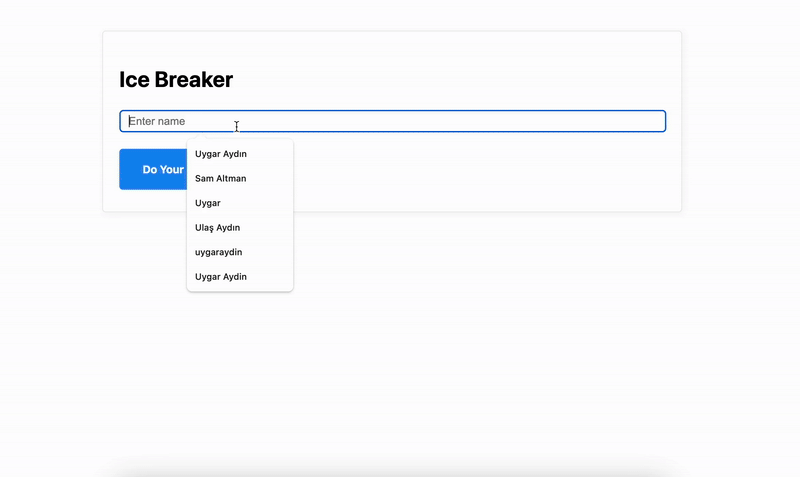

# 🧊 Ice Breaker with AI Agent

An AI-powered LinkedIn profile analyzer that automatically finds profiles, extracts professional information, and generates conversation starters using advanced language models and intelligent agents.

## Features

* **Smart Profile Search** - Automatically finds LinkedIn profiles using AI agents and web search
* **Profile Data Extraction** - Scrapes comprehensive LinkedIn profile information
* **AI-Powered Analysis** - Generates personalized summaries and interesting facts
* **Flask Web Application** - Lightweight web server with clean, responsive interface
* **Interactive Processing** - Dynamic loading states and smooth user experience
* **Agent-Based Workflow** - Uses LangChain agents for intelligent profile discovery
* **Structured Output** - Pydantic models ensure consistent, validated results

## 🎬 Demo



*Enter a name → Get instant AI-generated profile summary with interesting facts*

## Installation

```bash
git clone https://github.com/uygaraydin/ice-breaker.git
cd ice-breaker
pipenv install
pipenv shell
```

## Environment Setup

Create a `.env` file in the project root:

```
OPENAI_API_KEY=your_openai_api_key
SCRAPIN_API_KEY=your_scrapin_api_key
TAVILY_API_KEY=your_tavily_api_key
LANGCHAIN_API_KEY=your_langchain_api_key
```

**Get your API keys:**
* **OpenAI API**: https://platform.openai.com/
* **Scrapin.io API**: https://scrapin.io/ (for LinkedIn profile scraping)
* **Tavily API**: https://tavily.com/ (for web search functionality)
* **LangChain API**: https://smith.langchain.com/ (for tracing and monitoring)

## Usage

**Run the application:**

```bash
python app.py
```

Then open your browser and go to `http://localhost:5001`

**How to use:**
1. **Enter a person's name** in the input field
2. **Click "Do Your Magic"** - the AI agent will find and analyze their LinkedIn profile
3. **View comprehensive results** including profile photo, summary, and interesting facts

## How It Works

The system follows this workflow:
1. **Profile Discovery** - AI agent searches for LinkedIn profiles using Tavily search
2. **Data Extraction** - Scrapes profile information using Scrapin.io API
3. **AI Analysis Pipeline**:
   - Profile Processing → Summary Generation → Fact Extraction
4. **Structured Results** - Presents organized profile analysis with photo

## Project Structure

```
ice-breaker/
├── app.py                          # Flask web application
├── ice_breaker.py                  # Main ice breaker logic
├── output_parser.py                # Pydantic models and parsers
├── agent/
│   └── linkedin_lookup_agent.py    # LinkedIn profile lookup agent
├── third_parties/
│   └── linkedin.py                 # LinkedIn scraping functions
├── tools/
│   └── tools.py                    # Tavily search tools
├── templates/
│   └── index.html                  # Web interface
├── Pipfile                         # Pipenv dependencies
├── Pipfile.lock                    # Locked dependency versions
├── requirements.txt                # Python dependencies (backup)
├── .env                           # Environment variables (you create this)
├── .gitignore                     # Git ignore file
└── README.md                      # This file
```

## Dependencies

```
flask
langchain
langchain-community
langchain-openai
langchain-core
pydantic
python-dotenv
requests
```

## Contributing

Feel free to submit issues and pull requests to improve the application!
